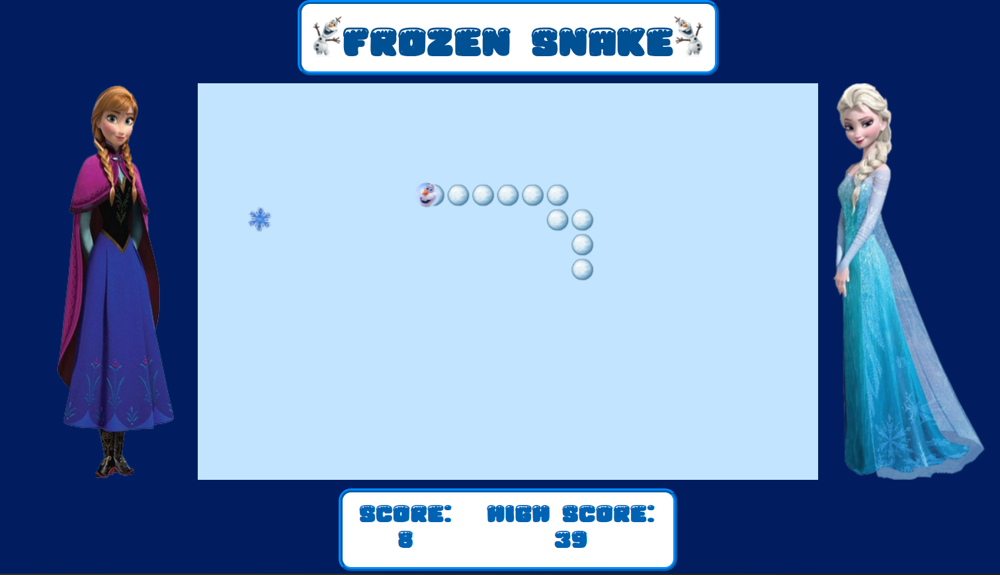
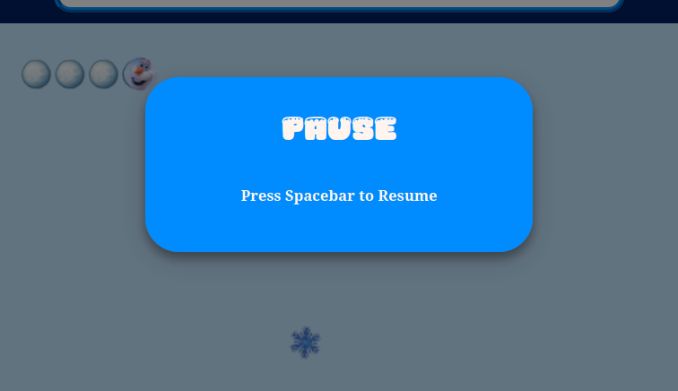

# Frozen Themed Snake Game

> A new version of the classic Snake game with a new thematic twist

  

Play the game [HERE](https://bbastanza.github.io/snake/)!

## Summary

This is a version of the classic snake game made with the Frozen theme for children in 2020 to enjoy. I made this game to challenge myself in using game logic in vanilla Javascript.

While building this project I was pushed to be creative with semi-complex game logic. I used the HTML canvas element to create the game and "draw" it's features. I learned a ton about how movement really works in game play. There are many things in Javascript that make this concept approachable, but it still provided it's fair share of problems. At first glance this game seams incredibly simple, but after diving in, I really started to see it's complexity.

This project opened up a new world of imagination in myself and I am excited to see where it takes me!

> I used a wire frame to sketch out the initial concept. See that wire frame outline [here](https://wireframe.cc/KAhT4E)

## Author

### Brian Bastanza- Full Stack Web Developer

[Personal Website](www.brianbastanza.com)

[LinkedIn](www.linkedin.com/in/brian-bastanza-9035397b)
